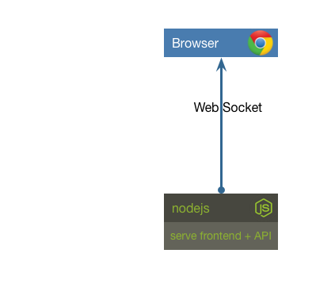

# Frontend



In this challenge we have a simple frontend for our system. Let's start by installing the dependencies and running it.

If you haven't done so already, run `yarn install` in the top level directory of this repo.

```sh
cd frontend/
node .
```

Point your browser to [http://localhost:10001](). You should see a chart. Simple!

## Challenge 1

Your challenge is to start the frontend so that it's listening on port 10001. Verify the results by pointing your browser to [http://localhost:10001](). You should see a chart. Simple!


__hint__ the frontend expects an environment variable named PORT


## Next Up: [Challenge 2](../challenge2/README.md)
