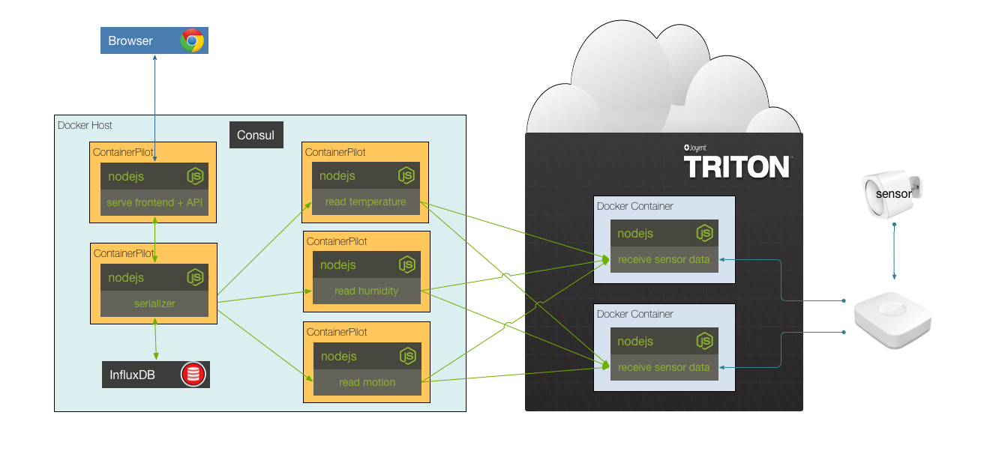

## Solution to Challenge 10

1. Change the serializer entry in the `docker-compose.yml` file

from
```
ports:
  - "10000:10000"
```

to

```
ports:
  - "10000"
```

2. Build and run the containers `docker-compose up -d`
3. Scale the serializer with `docker-compose scale serializer=2`
4. Uh oh, nothing knows about the second serializer instance!

Stop the containers by using the `docker-compose down`.


## Challenge 11




## Next Up: [Challenge 12](../challenge12/README.md)