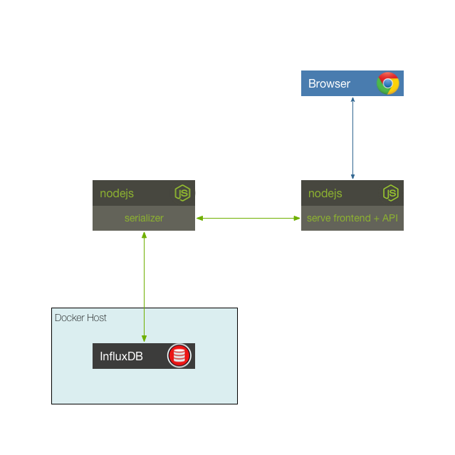

## Solution to Challenge 3

1. The container can be started with the run script `./influx/run.sh`
2. Start the serializer with the required environment variables

```sh
INFLUXDB_HOST=localhost INFLUXDB_USER=root INFLUXDB_PWD=root PORT=10000 node .
```

3. execute curl

```sh
curl -X POST -d '{"role": "serialize", "cmd": "write", "type": "temperature", "value": 32}' http://localhost:10000/act  --headerntent-Type:application/json"
```

4. Point your browser to [http://localhost:8083/]() to open the influx dashboard and search for the entries you inserted.

```
select * from temperature
```

Stop the container by using the `docker kill` or `docker stop` commands.


## Challenge 4




## Next Up: [Challenge 5](../challenge5/README.md)